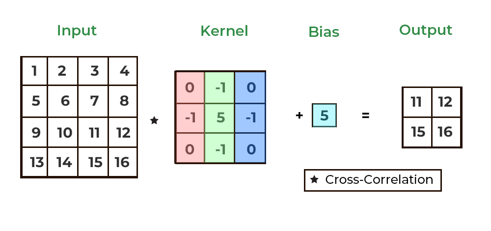
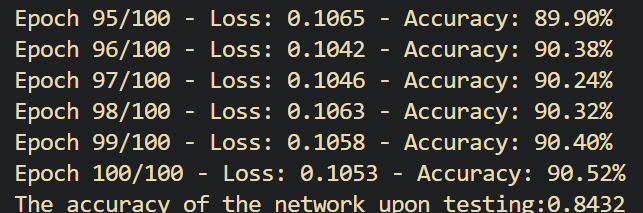
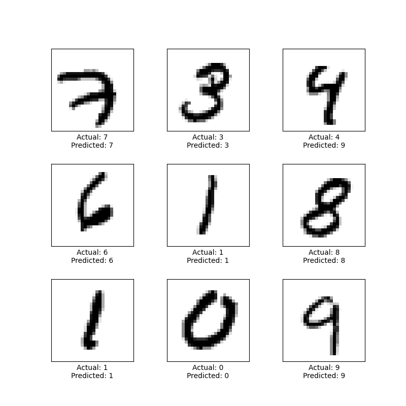

# MNIST-CNN

This is my implementation of the CNN. The project was done mainly for educational purposes and to make sure I have a good grasp on the basics of neural networks. 

# How does it work?

The core of the convolutional neural network is, as the name implies, the convolutional layer. The layer utilizes the convolution (actually, the correlation) operation to extract features and thus create feature maps of the input. Below is an illustration of how a convolution works: 

Apart from the convolutional layer, there are also the MaxPool and Dense layers (in my implementation, the output of each layer is activated by default, rendering the activation layer unnecessary). First, the input is correlated with the Convolutional layer kernels, then it is passed down to the MaxPool layer for it to extract the most important features out of the feature maps. Finally, the Dense layer accepts MaxPool's output and makes its prediction. Below is an illustration of how the MaxPooling operation works:

# Network performance

The maximum achieved accuracy upon training on the test dataset -- 84.32%. The network's performance in greater detail is as follows:

# ToDo

The main goal is adding more convolutional and pooling layers, as well as trying out different loss functions. Hyperparameter optimization is also credible. 
